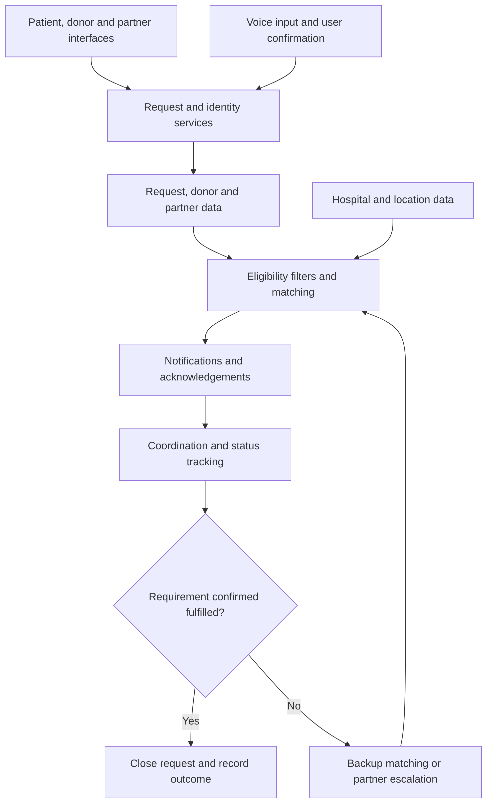

# 🩸 BloodNearby

### Multilingual Blood Request and Donor Coordination Platform

> Connecting patients’ families, nearby donors, and partner organisations to make blood support easier to coordinate.

**[Explore the prototype](https://bloodnearby.vercel.app/)**

**Project stage:** Web prototype with demo content and proposed operational features. Clinical deployment and real-world impact have not yet been established.

---

## 📌 Project Details

| Item | Details |
|---|---|
| Project title | BloodNearby — Multilingual Blood Request and Donor Coordination Platform |
| Domain | Healthcare · Social Impact · Digital Accessibility |
| Project category | Software / Web Platform |
| Team name | Shadow |
| College | Delhi Technological University (DTU), Delhi, India|
| Incubator | TODO: Enter incubator name, or “Not affiliated” |
| Hackathon / event | Codex 3.O |
| Track / problem statement ID | Open Innovation |
| Public repository | https://github.com/Viberscode/bnb_final |
| Live prototype | https://bloodnearby.vercel.app/ |
| Demo video |  |
| Architecture PDF/PPT | TODO: Add a public link to the architecture file |
| Project presentation PDF/PPT | TODO: Add a public link to the presentation |

### 👥 Team Details

**Team Leader:** Amulya Singla

**Team Member:** Medhansh Garg

**Team Member:** Himanshu Singhal

## 🌍 Overview

BloodNearby is a web platform designed to help people raise blood requests, coordinate with nearby donors, and involve NGOs or hospitals when additional support is needed.

The prototype brings together a patient-facing request flow, donor registration entry point, partner onboarding, a public request feed, hospital mapping, and Hindi/English voice-request entry points.

Our development goal is a complete coordination process—from raising a need to confirmation of fulfilment by the responsible blood centre or hospital.

The project is being developed across multiple hackathons, with each iteration improving the same platform through feedback, technical validation, and eventual local pilot partnerships.

## 🔎 Problem Statement

Patients’ families can struggle to identify available blood support, contact suitable donors, and coordinate with blood centres within the required timeframe. Information shared through calls or messages may be incomplete, outdated, duplicated, or difficult to follow up.

**Our project problem statement:**

Build an accessible platform that captures blood requirements, helps coordinate suitable nearby donor responses, supports partner escalation, and tracks the request until fulfilment is confirmed.

The platform aims to address:

- Fragmented communication between families, donors, and organisations.
- Difficulty communicating urgency and the hospital location clearly.
- Language and typing barriers during stressful situations.
- Uncertainty about whether a donor has accepted, arrived, or completed donation.
- Requests that remain open after fulfilment or lose support after cancellation.
- The need to distinguish donor willingness from confirmed blood-stock availability.

## 🏥 Healthcare Use Cases

| Use case | Intended platform support |
|---|---|
| Urgent hospital requirement | Capture the need, hospital, contact details, and required timeframe; coordinate responses |
| Planned procedure | Allow advance requests and donor coordination |
| Recurring transfusion support | Future scheduling and consent-based donor follow-up |
| Multiple patients | Capture separate group and quantity requirements; track partial fulfilment |
| No donor response | Proposed escalation to verified partner coordinators and blood centres |
| Language or typing difficulty | Hindi/English voice-assisted request entry with manual fallback |

Clinical decisions, donor eligibility, blood testing, compatibility assessment, and transfusion remain the responsibility of qualified healthcare professionals and authorised blood centres. BloodNearby is a coordination tool.

## ✨ Features and Implementation Status

The status below reflects the public prototype. Backend functionality requires end-to-end verification.

| Feature | Current status |
|---|---|
| Patient, donor, and NGO/hospital entry points | Available in the prototype |
| Single / multiple-patient request selection | Available in the request interface |
| Eight ABO/Rh blood-group options | Available in the request interface |
| Critical, urgent, and planned urgency choices | Available; represent requested timeframes |
| Hospital search and map | Available; Leaflet/OpenStreetMap attribution shown |
| Requester name, phone, and optional notes | Available in the request form |
| Voice request and voice-note controls | Interface available; recognition, recording, and delivery require validation |
| Google sign-in | Interface available; authentication flow requires validation |
| Public request feed | Accessible |
| Partner directory | Accessible with sample entries and impact figures |
| Partner certificate and phone-verification controls | Interface available; verification service requires validation |
| Partner identity check | Demonstration using mock KYC |
| Blood-group compatibility guide | Educational interface |
| Network statistics | Demo data |
| Automated matching, notifications, and live donor tracking | Described in the prototype; end-to-end operation requires verification |
| Component and units fields | Planned improvement |
| Confirmed blood-bank stock search | Planned; no operational integration established |
| Backup donor and cancellation handling | Proposed workflow |
| Hospital-confirmed fulfilment | Proposed workflow |

## 💡 Innovation and Differentiation

The intended differentiator is the combination of multilingual request entry and continued coordination until the requirement is confirmed as fulfilled.

- **Accessible requests:** Hindi/English voice entry alongside manual forms.
- **Location-aware coordination:** Hospital context and nearby donor discovery.
- **Urgency-aware response:** Prioritisation based on the required timeframe.
- **Complete follow-up:** Proposed acknowledgement, arrival, cancellation, escalation, and confirmed closure.
- **Partner participation:** NGOs and hospitals can support requests needing additional coordination.

These are product design directions, not measured claims of superiority.

Existing services such as [e-RaktKosh](https://eraktkosh.mohfw.gov.in/) already support blood-centre and component availability searches. BloodNearby aims to complement that capability through coordination. Any future integration requires an authorised source and a verified technical arrangement.

## 🔄 Intended End-to-End Workflow

1. **Raise:** A family member enters the hospital, blood group, urgency, and contact details. Future versions will add component, units, and required-by time.
2. **Confirm:** The requester reviews details and completes contact verification. A hospital or coordinator confirms the clinical requirement where appropriate.
3. **Match:** Eligible, consenting, available donors are shortlisted using suitable operational rules.
4. **Notify:** Donors receive an actionable request and accept or decline.
5. **Coordinate:** The requester receives status updates; backup donors remain available where needed.
6. **Escalate:** Unanswered requests or cancellations trigger partner follow-up.
7. **Close:** The responsible centre confirms fulfilment, remaining units are reconciled, and notifications stop.

**Status distinction:** Donor acceptance does not mean blood is ready for transfusion. Arrival and donation must not automatically mark the patient’s requirement fulfilled.

## 🧩 Platform Modules

| Module | Purpose |
|---|---|
| Patient / caregiver interface | Create, review, and follow requests |
| Donor interface | Register, manage availability, and respond to requests |
| Partner interface | Onboard organisations and coordinate escalations |
| Geospatial service | Hospital selection and location-aware discovery |
| Voice interface | Convert spoken input into a reviewable request |
| Matching service | Proposed rule-based shortlist and prioritisation |
| Notification service | Proposed delivery, acknowledgement, retries, and escalation |
| Request lifecycle service | Proposed partial fulfilment, cancellation, expiry, and closure |
| Administration and verification | Proposed review, reporting, access control, and audit history |

## 🏗️ Architecture and Technical Approach

The diagram describes the target architecture. Some services remain proposed or require end-to-end verification.

**Architecture PDF/PPT:** TODO: Add a public link to the architecture document.

### Data Sources and Handling

- User-submitted requests and contact information, collected with consent.
- Donor profiles, current availability, and relevant screening information.
- Partner registration documents, reviewed through an appropriate verification process.
- Hospital/map data; a map listing does not establish blood-bank capability.
- Future authorised blood-stock feeds or partner-confirmed inventory, including source and update timestamp.

No operational blood-stock feed, official partnership, or access to government APIs is claimed in the current prototype.

## 🛠️ Proposed Technical Stack

| Layer | Technology | Purpose |
|---|---|---|
| Deployment | Vercel | Host and deploy the web application |
| Mapping | Leaflet.js + OpenStreetMap | Display hospital locations and interactive maps |
| Authentication | Supabase Auth + Google OAuth | Manage Google sign-in and user sessions |
| Frontend framework / language | React + TypeScript + Vite | Build the user interface and application logic |
| Styling / UI libraries | Tailwind CSS + shadcn/ui | Create responsive layouts and reusable interface components |
| Backend / API framework | Supabase Edge Functions | Execute server-side matching, verification, and notification logic |
| Database and real-time transport | Supabase PostgreSQL + Supabase Realtime | Store requests and donor profiles; deliver live status updates |
| Speech recognition / recording | Web Speech API + MediaRecorder API | Transcribe spoken requests and record voice notes |
| Notifications | Firebase Cloud Messaging | Send browser push notifications |
| Testing and monitoring | Playwright + Sentry | Test user journeys and monitor application errors |

> This table describes the proposed stack. Vercel and Leaflet/OpenStreetMap were observed in the public prototype; the remaining tools require confirmation from the source code. Hindi/English speech recognition and browser notification support will be validated on target devices.

## 🤖 AI/ML Model or Framework Details

A trained ML model, training dataset, evaluation result, or inference implementation has not yet been documented here.

| Capability | Approach and status |
|---|---|
| Donor prioritisation | Proposed deterministic rules; not inherently ML |
| Voice transcription | Interface present; underlying engine and testing TODO |
| Structured voice-request extraction | Proposed extraction of group, hospital, and urgency with user confirmation |
| Donor response likelihood | Possible future model requiring consented historical data and evaluation |
| Demand forecasting | Future exploration requiring sufficient historical demand data |

### Proposed Matching Approach

Apply operational suitability filters before ranking candidates. Then consider:

- Request urgency.
- Donor’s current availability.
- Estimated travel time.
- Recent notifications and commitments.
- Relevant donation history.

Hospital/blood-centre screening remains authoritative.

### Model Documentation

TODO: Document the actual implementation using the following fields:

| Field | Details |
|---|---|
| Model / engine name and version | TODO |
| Framework | TODO |
| Input | TODO |
| Output | TODO |
| Dataset or data source | TODO |
| Training / inference approach | TODO |
| Inference location | TODO |
| Evaluation method and results | TODO |
| Failure handling | TODO |

If no ML model is implemented, state **“Rule-based prototype; ML not implemented”** and verify whether this meets the event’s requirements.

## 🧪 Validation and Reliability

Proposed validation includes:

- Complete a test request with consenting test participants through notification, acknowledgement, cancellation, escalation, and confirmed closure.
- Test simultaneous acceptance, partial fulfilment, duplicate requests, and donor no-shows.
- Test Hindi/English voice input, corrections, noisy environments, and transcription failure.
- Test unavailable GPS, map loading failure, poor connectivity, and manual location entry.
- Confirm that unauthorised users cannot access private contact information or documents.
- Test on mobile devices, with keyboard navigation and assistive technology.

| Metric | Meaning | Current result |
|---|---|---|
| Time to first acknowledgement | Request creation to donor/partner acknowledgement | Not measured |
| Confirmed fulfilment rate | Requests confirmed fulfilled / valid requests | Not measured |
| Time to confirmed fulfilment | Creation to centre-confirmed closure | Not measured |
| Cancellation / no-show rate | Accepted commitments not completed | Not measured |
| Voice field accuracy | Correctly extracted required fields in a defined test set | Not measured |
| Unresolved request rate | Requests remaining unfulfilled at deadline | Not measured |

No lives-saved count, accuracy percentage, or response-time guarantee is claimed.

## 🔐 Privacy, Trust, and Clinical Boundaries

- Use explicit consent for contact sharing, notifications, voice recording, and location access.
- Limit contact and location visibility to authorised participants.
- Distinguish registered, identity-checked, organisation-verified, and clinically screened statuses.
- Treat mock KYC as a demonstration, not completed verification.
- Clearly label sample partners and simulated impact statistics.
- Implement access control, abuse reporting, document protection, retention limits, and audit history before a live pilot.
- Present compatibility information as an educational red-cell guide; component-specific clinical decisions belong to the blood centre.
- Keep direct hospital/blood-centre contact options accessible for time-critical needs.

## 📈 Expected Impact and Sustainability

BloodNearby aims to:

- Reduce the effort required to coordinate blood requests.
- Improve visibility of request progress.
- Make request creation more accessible.
- Help partners identify unresolved needs.
- Improve follow-up when donors cancel or do not respond.

These are expected outcomes, not validated results. A pilot should measure fulfilment and delays rather than treating donor registrations or acceptance counts as patient outcomes.

Potential sustainability routes include institutional support, grants, and NGO/hospital partnerships. The operating model, staffing, notification costs, and maintenance funding remain to be defined.

## 🚀 Development Roadmap

| Phase | Focus |
|---|---|
| Foundation | Confirm actual stack, improve request fields, unify sign-in behaviour, label demo content, and publish documentation |
| Coordination | Implement notifications, acknowledgements, backup donors, cancellation handling, partial fulfilment, and confirmed closure |
| Availability | Add verified blood-centre records and timestamped stock data through authorised arrangements |
| Accessibility | Validate voice entry and improve mobile, keyboard, screen-reader, and low-bandwidth flows |
| Pilot | Work with a participating blood centre and consenting donors in one locality; collect feedback and measure outcomes |
| Scale | Expand after operational reliability, privacy controls, partner capacity, and support processes have been validated |

## 💻 Run Locally

Exact installation commands depend on the source repository and have not yet been documented.

1. Clone this repository and open the project directory.
2. Read the dependency manifest and use its specified runtime and package manager.
3. Install dependencies using the repository’s lockfile.
4. Configure the environment variables required by the actual implementation.
5. Run the development command documented by the project scripts.
6. Use test accounts and synthetic requests when testing notifications and fulfilment.

**TODO:** Add tested installation commands, runtime versions, environment-variable examples, and build/test instructions.

Keep API keys, private credentials, and sensitive data out of the repository.

## 🎥 Demo Video — 15–20 Minutes

**Unlisted YouTube link:** TODO: Paste the actual video URL.

### Suggested 18-Minute Walkthrough

| Time | Content |
|---|---|
| 0:00–2:00 | Team, problem, intended users, and project scope |
| 2:00–5:00 | Patient request journey and hospital selection |
| 5:00–8:00 | Donor journey and actual working response flow |
| 8:00–10:00 | Partner onboarding and coordination |
| 10:00–12:00 | Voice interface; clearly identify simulated behaviour |
| 12:00–14:00 | Architecture, actual stack, and AI/ML details |
| 14:00–16:00 | Failure handling, privacy, validation, and limitations |
| 16:00–18:00 | Outcomes achieved, pilot plan, and roadmap |

Use synthetic patient details. Identify each demonstrated capability as working, simulated, or planned.

## 📄 Presentation and Supporting Documents

| Deliverable | Public link |
|---|---|
| Architecture diagram in PDF/PPT format | TODO |
| Project presentation in PDF/PPT format | TODO |
| 15–20-minute unlisted YouTube demo | TODO |

The presentation covers:

- Problem statement and healthcare use case.
- Intended users and stakeholders.
- Proposed solution and differentiators.
- Features and modules.
- Architecture and technical stack.
- AI/ML approach.
- Implementation status.
- Validation and achieved outcomes.
- Limitations and development roadmap.

**Public accessibility:** The repository and all linked deliverables should be viewable without additional access permissions. Verify each link in a signed-out browser.

## 📜 Open-Source Licence Details

**Licence:** TODO: Specify the licence selected by the repository owners.

Add the full licence text in a `LICENSE` file and record relevant third-party dependencies and licences.

Until a licence is added, the repository’s open-source licensing status remains unspecified. The code licence does not authorise publication of patient data, donor information, identity documents, or private credentials.

## 🤝 Contributions

Contributions can focus on:

- Accessibility and multilingual support.
- Request lifecycle handling.
- Verified directory data.
- Reliability and failure handling.
- Privacy and access controls.
- Documentation and testing.

Describe the problem and proposed change in an issue before a substantial implementation.

Do not upload personal medical information, private contacts, credentials, or identity documents in issues or pull requests.

---

**BloodNearby — Making blood support easier to request, coordinate, and follow through.**
